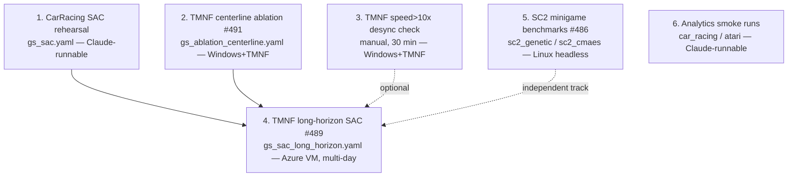

# Training-run roadmap

> Compiled 2026-07-16 from: `docs/research/tmrl-linesight-reward-obs.md` (#485/#495),
> `plans/issues-489-491-492-493-494-tmnf-sac-run-prep.md` (#498), the open issue
> backlog (#489, #491, #486, #449-family), and the configs that landed in
> v0.9.3–v0.9.12 (PRs #497–#505, #471). Every run below has a ready-made,
> tested config on `main` — what's missing is only the compute/execution.

## The runs, in order

### 1. CarRacing SAC validation run — `games/car_racing/config/gs_sac.yaml`

- **What:** single-combo SAC run, `total_timesteps: 500_000`, on CarRacing-v3.
- **Why first:** it is the cheapest end-to-end rehearsal of the *exact*
  mechanics #489 depends on — SB3 SAC through the framework loop, the
  `checkpoint_freq` crash-safe resume path (#488), and the new analytics
  reporting — on a game that needs no game binary, no Windows, no money.
  Any bug it flushes out is a bug #489 would otherwise hit three days into
  a paid Azure run. It also answers "does our SAC wiring actually learn"
  against CarRacing's published solved-benchmark (≥900 avg reward / 100
  episodes, asserted by the analytics from #497).
- **Machine:** any (pure Python). **Claude can run this directly** — torch
  is already installed here; only `pip install swig "gymnasium[box2d]"` is
  missing. Est. hours-scale on CPU; survivable across container restarts
  via #488 checkpoints if the experiment dir is pushed/preserved.

### 2. TMNF centerline ablation — issue #491, `games/tmnf/config/gs_ablation_centerline.yaml`

- **What:** 2-combo A/B, `centerline_weight: -0.083` (current default) vs
  `0.0` (progress-only shaping), everything else fixed.
- **Why before #489:** the research doc's top finding — neither tmrl nor
  Linesight uses a lateral-offset penalty at all, and ours may be actively
  fighting `progress_weight` on corner-cutting lines. The winner **feeds
  directly into `gs_sac_long_horizon.yaml`** (the file's header marks the
  exact key to update). Running #489 before this means potentially baking a
  counterproductive reward term into a multi-day paid run.
- **Budget:** 2 × (probe + cold-start + `n_sims` greedy episodes) at 10×
  game speed — an afternoon, not days.
- **Machine:** Windows + TMNF + TMInterface (your rig). **Claude cannot run
  this** — no TMNF binary can exist in this Linux container.

### 3. (Optional, 30 min) TMNF `speed > 10×` desync check

- **What:** the research doc's "verify, don't act" item: Linesight trains at
  80×, our docs call 10× the max. Manually try 15×/20×/40× on your rig and
  watch for dropped inputs / desyncs under `clients/rl_client.py`'s
  queue handshake.
- **Why here:** if >10× is stable, #489's wall-clock cost drops
  proportionally — worth knowing *before* renting the VM. If it desyncs,
  nothing changes.
- **Machine:** Windows + TMNF. **Claude cannot run this.**

### 4. TMNF long-horizon SAC run — issue #489, `games/tmnf/config/gs_sac_long_horizon.yaml`

- **What:** the flagship run. Single-combo SAC, `total_timesteps:
  3_000_000`, 16 lidar rays, `action_window_ticks: 5` (20 Hz per #494),
  `checkpoint_freq: 20_000`, driven unattended by
  `infrastructure/environment/run_supervised.ps1` with crash-restart +
  #488 resume.
- **Order dependency:** after (1) has proven the SAC/checkpoint mechanics
  and (2) has settled `centerline_weight`. Optionally also after
  re-considering the lookahead knobs (#493's `n_lookahead_points` /
  `lookahead_step_spacing` are now configurable but the run config hasn't
  picked non-default values — a decision to make when finalizing the
  config, not necessarily a separate run).
- **Machine:** Azure Windows VM (`worker_vm_count = 1`), per the runbook in
  `infrastructure/README.md`. **Claude cannot run this** — it needs a live
  TMNF process *and* a human decision on cloud spend (`terraform apply`,
  RDP, kick off supervisor). Multi-day.

### 5. SC2 minigame benchmarks — issue #486 (independent track)

- **What:** run `sc2_genetic` and `sc2_cmaes` on the standard PySC2
  minigames (MoveToBeacon, CollectMineralShards, …) and table the champion
  scores against published DeepMind/Reaver numbers.
- **Order:** fully independent of the TMNF track — can run any time,
  in parallel with 1–4.
- **Machine:** Linux headless works (this repo's SC2 stack is
  Linux-first). **Claude could run this in principle, with caveats:** it
  needs the Blizzard headless SC2 binary + minigame maps downloaded
  (multi-GB against this container's fixed disk allowance) and
  hours-per-minigame budgets (`n_sims × population_size` full episodes,
  ~1 CPU + 1.5 GB RSS per binary). Treat as "possible on request" rather
  than a default — a dedicated Linux box is a better home for it.

### 6. Analytics smoke runs for the newly landed per-game analytics

Each of the six analytics PRs' issues had "a short smoke run drops
game-relevant plots into `experiments/.../results/`" as its validation —
unit tests cover the plots synthetically, but nothing has exercised them
against a real env yet:

| Game | Config to smoke | Machine | Claude-runnable? |
|---|---|---|---|
| car_racing | `gs_genetic.yaml` (trimmed `n_sims`) | any | **Yes** (after box2d install) |
| atari | `gs_minimal_pong_dqn.yaml` (or trimmed) | any | **Yes** (`poetry install --with atari`) |
| assetto_corsa | `gs_genetic.yaml` | Windows + AC (commercial) | No |
| beamng | `gs_genetic.yaml` | Windows + BeamNG (commercial) | No |
| rocket_league | any `gs_*.yaml` | Windows + RL + Bakkesmod | No |
| iracing | `gs_genetic.yaml` (telemetry_only) | Windows + iRacing sub | No |

Low priority — these validate plumbing, not hypotheses — but the two
Claude-runnable ones are nearly free and would close the loop on the
#449 family's validation criteria.

## What Claude can execute directly, summarized

**Runnable in this container today** (all deps present or one install away):

1. **CarRacing SAC validation** (`gs_sac.yaml`, 500K steps) — the highest-value
   one: a genuine de-risking rehearsal for #489, not just a smoke test.
2. **CarRacing template smoke runs** (`gs_genetic` / `gs_cmaes` /
   `gs_hill_climbing`, trimmed budgets) — validates #500's templates and
   #497's analytics on real episodes.
3. **Atari Pong DQN** (`gs_minimal_pong_dqn.yaml`, ~0.5–1M env steps, or a
   trimmed variant) — validates #471's analytics and gives a first Pong
   learning curve.

**Possible but needs a go-ahead:** SC2 benchmarks (#486) — multi-GB binary
download against limited disk, hours of compute.

**Impossible here, needs you (or a VM):** everything TMNF (#491, the speed
check, #489) and every commercial-game smoke run (assetto, beamng,
rocket_league, iracing).

Caveats for container runs: the environment is ephemeral — long runs must
lean on #488's checkpointing, and results (`experiments/` is git-ignored)
need to be explicitly exported (e.g. committed to a results branch or
attached to the issue) before the session is reclaimed. Suggested next
action if you want me to start: I'd kick off (3) Atari Pong and (2) a
CarRacing genetic smoke first (fast, bounded), then start (1) the CarRacing
SAC run in the background with periodic check-ins.
